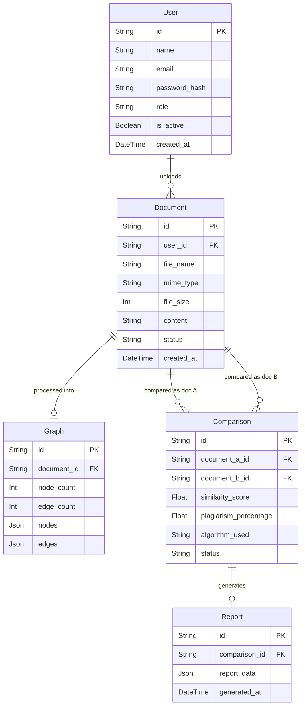

# Graph-Based Plagiarism Detection System

A full-stack, state-of-the-art system that detects document plagiarism by converting text into graph structures and comparing structural node/edge similarities using advanced graph algorithms.

---

## 🚀 Overview

This repository contains both the **Frontend** and the **Backend** of the Graph-Based Plagiarism Detector. Unlike traditional plagiarism tools that rely on simple string matching, this system analyzes the **logical structure** of documents by representing them as mathematical graphs.

- **Frontend**: A modern, responsive React 19 + Vite 6 application featuring interactive 3D graphs, dashboards, and detailed comparison reports.
- **Backend**: A high-performance Python FastAPI service integrated with NetworkX for graph processing and Prisma ORM for database management.

---

## ✨ Core Features

- **Structural Graph Analysis**: Converts text into nodes (sentences/entities) and edges (relational logic) for similarity detection.
- **Interactive 3D Visualization**: Explore document structures and overlaps in an interactive 3D WebGL environment via `react-force-graph-3d`.
- **Multi-Algorithm Comparison**: Choose from Node Overlap, Edge Similarity, Subgraph Analysis, and Graph Edit Distance (GED).
- **Comprehensive PDF Reports**: Generate and download detailed plagiarism breakdown reports including stats and highlights.
- **Asynchronous Processing**: Background workers handle graph generation and heavy computations, ensuring a fast and fluid UI experience.
- **Modern Glassmorphism UI**: Beautifully designed dashboard with dark/light mode persistence and Tailwind CSS 4.

---

## 🏗️ System Architecture

The architecture relies on a REST API communication between the React frontend and the FastAPI backend. It utilizes a PostgreSQL database (Neon) to store users, documents, generated graphs, and comparison reports.

---

## 🗄️ Entity-Relationship (ER) Diagram

---

## 🛠️ Technology Stack

| Layer | Frontend | Backend |
|---|---|---|
| **Core** | React 19 + Vite 6 | Python 3.11 + FastAPI |
| **Styling** | Tailwind CSS 4 + Framer Motion | Loguru + Pydantic |
| **Animations** | GSAP 3 + Lucide Icons | - |
| **Logic** | Zustand + Axios + React Query | NetworkX + NLTK + Scikit-Learn |
| **Database** | - | Prisma ORM + PostgreSQL (Neon) |
| **Visualization** | Three.js + React-Force-Graph + Chart.js | - |
| **Reports** | - | ReportLab (PDF Generation) |

---

## 📡 API Endpoints

The system exposes a comprehensive REST API under the `/api/v1` versioning.

### 🔐 Authentication
| Method | Endpoint | Description |
|---|---|---|
| POST | `/api/v1/auth/register` | Create a new user account |
| POST | `/api/v1/auth/login` | Obtain a JWT access token |
| GET | `/api/v1/auth/me` | Fetch currently logged-in user profile |

### 📄 Document Management
| Method | Endpoint | Description |
|---|---|---|
| POST | `/api/v1/documents/upload` | Upload PDF/TXT/DOCX for graph conversion |
| GET | `/api/v1/documents/` | List all uploaded documents |
| GET | `/api/v1/documents/{id}` | Get specific document status and metadata |
| DELETE | `/api/v1/documents/{id}` | Remove a document from the system |

### 🔍 Plagiarism & Scans
| Method | Endpoint | Description |
|---|---|---|
| POST | `/api/v1/scan/` | Initiate a structural scan between documents |
| GET | `/api/v1/plagiarism/report/{id}` | Fetch detailed similarity breakdown |
| GET | `/api/v1/plagiarism/history` | View past comparison results |
| GET | `/api/v1/graph/{doc_id}` | Retrieve raw graph data (nodes/edges) |

### 📊 Analytics
| Method | Endpoint | Description |
|---|---|---|
| GET | `/api/v1/analytics/stats` | Fetch high-level usage metrics |
| GET | `/api/v1/analytics/activity` | Retrieve historical activity chart data |

---

## 🏁 How to Use (User Guide)

1. **Onboard**: Register or Login to access your personal dashboard.
2. **Upload**: Navigate to the upload section and drop your files (.pdf, .txt, .docx).
3. **Wait for Processing**: The backend automatically converts text into a graph. Monitor the status (PENDING → PROCESSING → READY).
4. **Initiate Scan**: Select documents you wish to compare and choose a graph algorithm (e.g., Subgraph Matching).
5. **Analyze Result**: 
    - Interact with the **3D Force Graph** to see structural overlaps.
    - Review the **Similarity Percentage** and matching node list.
    - Download the **Detailed PDF Report** for formal documentation.

## 🏢 Where to Use (Use Cases)

- **🎓 Educational Institutions**: Detecting structural plagiarism in student assignments.
- **🔬 Research & Academia**: Checking for logic and structural duplication in research paper submissions.
- **📚 Publishing Industry**: Validating manuscript originality.
- **💼 Corporate Environments**: Ensuring consistency and originality in technical manuals/documentation.

---

## 📂 Repository Structure

- `/frontend/`: Contains the React/Vite 6 application. Includes interactive layouts, dark mode switches, and graph rendering logic.
- `/backend/`: Contains the FastAPI implementation with Prisma ORM, NLTK preprocessing, algorithm implementations, and Neon integration.

---

## 🚀 Getting Started

### Backend Setup
1. Navigate to `backend/`.
2. Install dependencies: `pip install -r requirements.txt`.
3. Configure `.env` with `DATABASE_URL` (Neon PostgreSQL) and `JWT_SECRET_KEY`.
4. Run: `prisma generate` and `prisma db push`.
5. Start: `uvicorn app.main:app --reload`.

### Frontend Setup
1. Navigate to `frontend/`.
2. Install: `npm install`.
3. Configure `.env` with `VITE_API_URL`.
4. Run: `npm run dev`.

---

## 🛡️ License

This project is licensed under the MIT License.