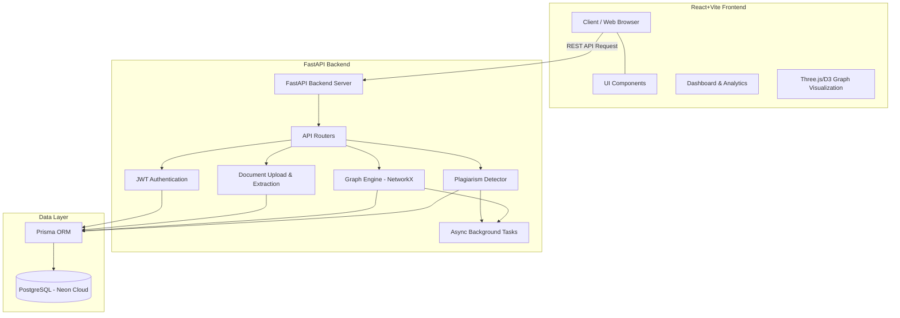
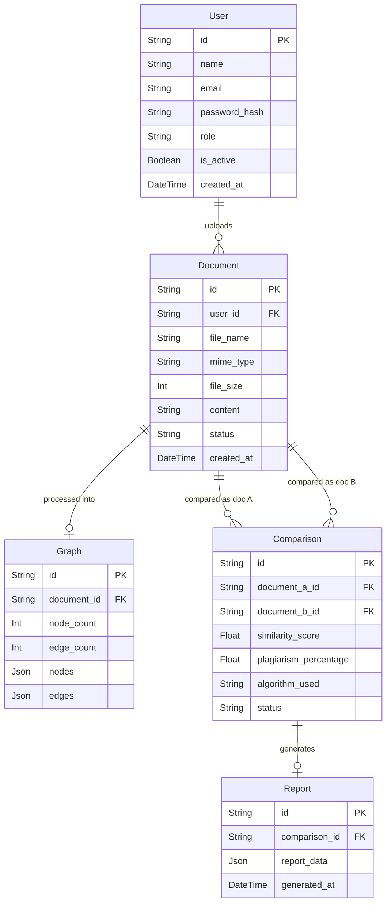

# Graph-Based Plagiarism Detection System

A full-stack, state-of-the-art system that detects document plagiarism by converting text into graph structures and comparing structural node/edge similarities using advanced graph algorithms.

## 🚀 Overview

This repository contains both the **Frontend** and the **Backend** of the Graph-Based Plagiarism Detector:
- **Frontend**: A modern, responsive React + Vite application featuring 3D graphs, dashboards, and detailed comparison reports.
- **Backend**: A high-performance Python FastAPI service integrated with NetworkX for graph processing and Prisma ORM for database management.

---

## 🏗️ System Architecture

The architecture relies on a REST API communication between the React frontend and the FastAPI backend. It utilizes a PostgreSQL database to store users, documents, generated graphs, and comparison reports. Background tasks handle the heavy lifting of graph generation and analysis.

---

## 🗄️ Entity-Relationship (ER) Diagram

---

## 📂 Repository Structure

- `/frontend/`: Contains the React/Vite web application. Includes interactive layouts, dark mode switches, and graph rendering logic.
- `/backend/`: Contains the FastAPI implementation with Prisma ORM, NLTK preprocessing, algorithm implementations, and Neon integration.

## 🏁 Getting Started

### Backend Setup
For detailed backend setup, see the [`backend/README.md`](./backend/README.md).
1. Navigate to the `backend/` directory.
2. Create and activate a virtual environment.
3. Install dependencies: `pip install -r requirements.txt`.
4. Set up `.env` with `DATABASE_URL` (Neon PostgreSQL) and `JWT_SECRET_KEY`.
5. Run Prisma generation and push: `prisma generate` and `prisma db push`.
6. Start the server: `uvicorn app.main:app --reload`.

### Frontend Setup
For detailed frontend setup, see the [`frontend/README.md`](./frontend/README.md).
1. Navigate to the `frontend/` directory.
2. Install Node dependencies: `npm install` or `npm install --legacy-peer-deps`.
3. Set up `.env` with `VITE_API_URL` pointing to the backend.
4. Run the development server: `npm run dev`.

---

## 🛡️ License

This project is licensed under the MIT License.